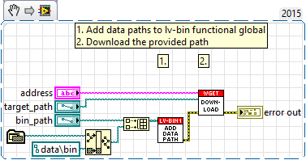

# lv-bin-wget

lv-bin-wget is a library that provides the ability to interact with the wget executable and download one or more files (similar to curl)

## Installation

The lv-bin-wget library requires lv-bin be installed via vipm or copied into <user.lib>/antonio-alexander/lv-bin and copying lv-bin-7zip into <user.lib>/antonio-alexander/lv-bin-7zip. The vipm installation is ideal in that it manages a lot of the extra effort for you (especially the palettes and paths).

This package was built specifically with **v1.20.3** of the wget executables, to download the binaries navigate to [https://eternallybored.org/misc/wget/](https://eternallybored.org/misc/wget/) and download the exe's for 32-bit and/or 64-bit wget.exe

## Description

As described above, this library allows you to download a file using the wget executable.

* api v1 (v1.lvlib)
  * download.vi: this vi can be used to download a file to a given target directory

## Example 01 - Download

